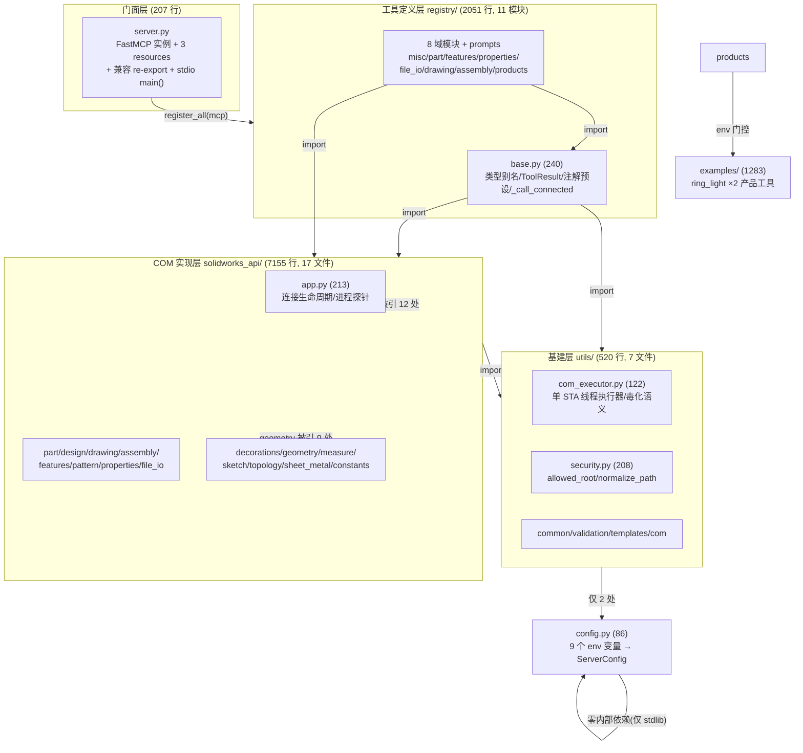

# 01 · Alex — 整体架构测绘（奠基报告）

> **审查日期**: 2026-09-06
> **代码快照**: 主仓 HEAD=0762b15（main，upstream=github/main，零未推送）；工作区 2 项未提交（`output/optimization-plan-2026-09-01.md` M——即 §19 U4/J3 闭环回填本体；`docs/review/` 未跟踪=本轮审查目录）。aicad 子仓 HEAD=9a80b13（origin=github/VisionFocus2022/aicad，**ahead 4**，另有 `config/providers.toml` M）。
> **方法**: 全程只读静态测绘。Read 精读 server.py / registry 全层 / utils 全层 / config.py / CI；grep 实证工具计数（`mcp.tool(` 与 `^def solidworks_` 双口径交叉）、分层依赖方向（import 全量聚合 + 反向依赖零命中复核）、上轮遗留逐项 git 取证。工具计数等否定性/一致性结论均双词形复核（K-9 纪律）。

---

## 1. 构建与运行体系

**包与依赖**（pyproject.toml:1-44）：
- `solidworks-mcp` v0.3.0，`requires-python >= 3.10`（实际运行 3.12，CI 同为 3.12）。
- 运行依赖仅 3 件：`pywin32>=306`、`mcp[cli]>=1.28.1,<1.29.0`（官方 SDK，stdio 传输）、`pydantic>=2.12,<3`。dev 附加：`coverage/pytest/pytest-asyncio`。
- 无 requirements.txt 与 pyproject 并行的双源——README:30 引用 `requirements.txt`，该文件存在于仓根（AGENTS.md 口径外，属历史遗留形态，见 AR-9）。
- 覆盖率：`[tool.coverage.report] fail_under = 80`（pyproject.toml:43），branch=true，source=solidworks_mcp（:40）。AGENTS.md:27 宣称"覆盖率红线 ≥89%（CI 硬门 80%）"——89% 为本地实绩口径，80% 为 CI 硬门，两口径并存成立。

**CI**（.github/workflows/ci.yml，单文件单 workflow）：
- 触发：`push: branches:[main]` + 全部 `pull_request`（ci.yml:4-7）。
- runner：`windows-latest`（注释明示原因：包在模块级 import pywin32/pythoncom，ci.yml:12）。
- 步骤：checkout → setup-python 3.12 → `pip install -e ".[dev]" pip-audit` → `coverage run --source=solidworks_mcp -m pytest -q` → `coverage report --fail-under=80` → `pip-audit --skip-editable`。
- 无 lint/type job，无 aicad 联动；安全扫描走 pip-audit（依赖 CVE 维度）。
- **G1 相关实证**：主仓 upstream 已切 `github/main`（`git branch -vv`），`@{u}..HEAD` = 0——上轮"15 提交未推"已清偿；ci.yml 推 main 即触发，afc9eaf 提交信息"双仓 CI 时代开启"+ plan §18 记录 aicad CI run 33599347169 双 job 全绿。**G1 主仓侧完全闭环，aicad 侧余 4 提交未推（AR-3）**。

**运行形态**：`python -m solidworks_mcp.server` / `.mcp.json` 配置 stdio 启动；实机 e2e 走 `tools/e2e_sw_smoke.py`（需 SW 运行）；探针在 `tools/probe_{part,assembly,drawing,properties}/` + `tools/INDEX.md` 索引、`tools/e2e_n28..n33.py` 每特性验收脚本、`soak_session.py` 浸泡测试——工具体系完整。

---

## 2. 分层架构

三层单向依赖，**编译级纯净**（反向依赖 grep 零命中复核：`solidworks_api/`、`utils/`、`examples/` 中 `from solidworks_mcp.registry|import registry` 均无命中）：



**依赖计数证据**（grep `^from solidworks_mcp` 全量聚合）：
- registry 层 import：api 14 模块（app/assembly/decorations/design×2/drawing/features×2/file_io/measure/part/pattern/properties/sheet_metal/topology）+ utils（com/com_executor/common×3/security）+ config + examples×2。
- api 层内部：`api.app` 被 12 个 api 模块 import（连接入口单点）；`api.constants`×7、`api.geometry`×9（mm_to_m 等共享）、`api.sketch`×3；utils 侧 `utils.com`×12、`utils.common`×12、`utils.validation`×8、`utils.security`×7、`utils.templates`×3。
- utils 层内部仅 2 处 import config（common.py/security.py）——基建层近零内聚耦合。
- **唯一受控环**：registry/base.py:181 `_capabilities()` 延迟 import `server.mcp`（函数体内 late import，注释明示防循环）——运行期单向，编译期无环。

**api→api 横向引用**（design↔features 各 1 处）存在但浅层；`examples/ring_light*.py` 1276 行是最大单体，仅被 products.py 引。

---

## 3. 工具契约与生命周期

**共享类型**（registry/base.py:40-64）：
- pydantic Annotated 别名：`PositiveMM/FiniteMM/SignedMM/NonNegativeMM`（均 `allow_inf_nan=False`，单位语义写进 description）、`FiniteAngle`（度）、`NonEmptyString`、`MateType/EntityType` Literal。
- `ToolResult` TypedDict（:72-77）：`success/data/message/warning/error` 五字段信封，`error` 为 `{code, details}` 结构——**全仓统一响应契约**，由 utils/common.py 的 `success_response/error_response` 构造。

**注解预设**（base.py:79-102）：`READ_ONLY`/`STATE_CHANGE`/`DESTRUCTIVE`/`IDEMPOTENT_WRITE` 四档 `ToolAnnotations`。DESTRUCTIVE 是 MCP 协议级 hint（destructiveHint=True），非强制拦截——实际拦截靠 file_io 的 overwrite_confirm 参数与 security 层（06 域深审）。

**执行生命周期**（base.py:135-160 `_call_connected`）：连接（`sw.connect(launch_if_needed)`，失败即返回）→ `run_com(invoke, timeout=_com_timeout())` 包装 → 三分支异常归一：`ComCallTimeoutError`→`SW_TIMEOUT`、`ComExecutorPoisonedError`→`_poisoned_response()`（SOLIDWORKS_MCP_POISONED_EXIT=1 时 `sys.exit(1)` 让 stdio 宿主监督者重启进程，:117-132）、其余→`SW_API_ERROR`（记 exception 日志，不泄栈给客户端）。

**单位换算**：MCP 入参 mm → COM 层 m，换算收口在 api 层——`mm_to_m` 定义于 solidworks_api/geometry.py:21，全 api 层 62 处调用（grep 实证）。registry 层不做换算（纯 mm 语义传递）。capabilities resource 声明 `tool_length=millimeter / solidworks_internal_length=meter`（base.py:188-193）。

**能力宣称防漂移**：tests/test_capabilities_sync.py 以 `_registered()`（`server.mcp._tool_manager.list_tools()` 运行时真相）对照 docstring/capabilities JSON/设计计划操作清单三向锁定，另含"不得对已注册域声明不支持"的反向断言（:28-30）。

**契约实例**（registry/file_io.py:53-62，导出类工具的标准形态，逐字引用）：
```python
def solidworks_file_export_step(
    file_path: NonEmptyString,
    overwrite_confirm: bool = False,   # 覆盖既有文件须显式确认
    launch_if_needed: Optional[bool] = None,
) -> ToolResult:
    """Export the active document to .step or .stp under allowed_root."""
    return _call_connected(
        lambda sw: export_step(sw, file_path, overwrite_confirm),
        launch_if_needed,
    )
```
`overwrite_confirm=False` 默认拒绝覆盖，确认逻辑沉在 api/file_io 层——registry 只透传。这是 DESTRUCTIVE 防线的第一道门（第二道在 security 路径校验）。

**utils 三小件的契约角色**：
- utils/common.py（37 行）：`success_response/error_response` 两个 dict 构造器——ToolResult 信封的唯一生产点（api 层 12 处引用）。
- utils/validation.py（42 行）：`finite_number/positive_number`（bool 显式拒绝——`isinstance(value, bool)` 先拦，防 True 被当 1.0 通过）与 `parse_bool` 严格布尔解析（拒绝 Python truthiness，"2" 抛错）。
- utils/com.py（24 行）：`call_or_value`——pywin32 late-binding 属性/方法二义性适配（`CDispatch` 类型名判别：属性返回 COM 对象则直取，否则可调用即调用，否则取值）；`make_error_variants`——OpenDoc6/Save3 出参所需的 `VT_BYREF|VT_I4` VARIANT 对。全 api 层 12 处引用，是 Mock 兼容性的关键缝（Mock 链上 getattr 返回 Mock，callable 恒真——上轮 wave2 的 Mock 真值陷阱即源于此形态，08 域深审）。

---

## 4. 工具注册与装配机制

**装配链**（server.py:150-163）：
1. `mcp = FastMCP("solidworks-mcp", instructions=...)`（:150）——instructions 含单位 mm、先调 capabilities、allowed_root 三条守则。
2. `mcp._mcp_server.version = __version__`（:160，SDK 1.x 构造器不带版本的 workaround）。
3. `register_all(mcp)`（:163）→ registry/__init__.py:36-40 按 `_DOMAINS` 九元组顺序（misc/part/features/properties/file_io/drawing/assembly/prompts/products）逐域调 `domain.register(mcp)`。

**域内注册形态**（以 misc.py:70-89 为范式）：域模块定义**纯函数**（可独立单测），`register(mcp)` 内逐个 `mcp.tool(title=..., annotations=预设, structured_output=True)(fn)` 显式挂接。**无装饰器自动注册**——这正是 `@mcp_tool` grep 零命中的原因；正确计数口径为 `mcp.tool(` 调用（81）与 `^def solidworks_`（81）双证一致。

**产品工具 env 门控**（products.py:25-29）：`SOLIDWORKS_MCP_PRODUCT_TOOLS` 含 `ring_light` 时 `register` 才挂 2 工具；函数本体无条件可 import（单测不依赖 env）。

**prompts**：registry/prompts.py 用 `mcp.prompt(` 注册 5 个（assembly/csg_rebuild/design_part/drawing/parametric）。

**stdio 启动时序**：`main()` → `_configure_logging()`（RotatingFileHandler 2MB×3，OSError 降级 StreamHandler，server.py:131-147）→ `mcp.run(transport="stdio")`。模块 import 即完成全部注册（server.py:163 在模块级），故 import 开销=注册开销，进程起来即全量工具可用。

**完整调用链**（一次 tool call）：
```
AI 客户端 ─JSON-RPC(stdio)→ FastMCP 分发
  → registry 域函数（pydantic 参数校验 → ToolResult）
  → _call_connected → run_com → ComExecutor STA 队列（com_executor.py）
  → api 层函数（mm_to_m 换算 → win32com 调用）
  → SolidWorks 2026 COM → 文档/特征变更
  ← dict 结果 → success/error_response → ToolResult JSON 回传
```

---

## 5. 运行时安全与执行链（边界速写，深审归 06）

- **COM 串行化**：utils/com_executor.py `ComExecutor` 单线程（`solidworks-com-sta`）+ `CoInitialize` STA 公寓（:46-63），队列分发 Future。超时后 worker 不可中断 → 标记 poisoned，后续全部 `ComExecutorPoisonedError` 快速失败——"一次卡死换进程重启"的诚实语义（:24-30 docstring）。
- **超时**：`SOLIDWORKS_MCP_COM_TIMEOUT_SECONDS` 默认 120s（config.py:79-81）；`_com_timeout()` 零/负→None 保持历史无超时模式（base.py:111-114）。
- **路径安全**：utils/security.py `normalize_path` 逐组件 realpath（junction 不被 `..` 词法折叠穿透）+ `_expand_long_path` 8.3 短名还原（:21-43，含 HEAD 0297d77 的"缓冲区不足返回值不可信"护栏）；`DEFAULT_ALLOWED_ROOT` 默认=项目根（config.py `_workspace_root`，2026-08-28 从父工作区收窄，杜绝误触 aicad/）。
- **配置面**：config.py 9 个 env（ALLOWED_ROOT/AUTO_START/SOLIDWORKS_VERSION/三类模板/LOG_PATH/COM_TIMEOUT/POISONED_EXIT + PRODUCT_TOOLS 在 products 侧）→ frozen dataclass `ServerConfig`，`get_config()` 每次现读（非缓存，热改 env 即时生效——也意味着每次工具调用有重复解析成本，见 AR-7）。

**连接生命周期**（api/app.py，全 api 层唯一连接入口，被 12 个 api 模块引用）：
- `SolidWorksApp` 类（:95-201）：`connect(launch_if_needed)`（:116）/`status()`（:178，带自愈断连探测）/`disconnect()`（:190）/`get_active_document()`（:195）；`get_solidworks_app()`（:211）模块级**单例**——registry/base.py `_sw()` 即转发此单例。
- 进程探针：`_is_solidworks_process_running()`（:46，ctypes Toolhelp 快照）+ `_same_session(pid)`（:18）——auto-start 决策只对同会话 SW 生效，防跨会话误附。
- aicad/interop/sw_app.py 为同源改编（docstring 自证，见 AR-4）。

---

## 6. 数据流（端到端）

**建模流**：AI 客户端 → MCP tool call（mm 参数）→ registry 校验 → STA COM → api（mm→m）→ SolidWorks 文档（内存模型 + 特征树）→ 查询类工具（list_features/mass_properties/bounding_box）原路返回 JSON。

**持久化/导出流**：文档 `.sldprt/.sldasm` 保存与 STEP 导入导出（api/file_io.py 354 行）→ 落盘路径经 allowed_root 校验 + overwrite_confirm 门 → 产出 STEP/STL/DXF；工程图 PDF/PNG 走 api/drawing.py（1036 行）。

**观测流**：capabilities/status/active-document 三 resource（server.py:166-196）只读探测；status 资源复用 `run_com(_sw().status)` 缓存连接探测不拉起 SW。

**sicad 桥接对比**：aicad 的 SolidWorks 桥（aicad/aicad/interop/ 9 模块）**零 import 依赖主仓**（grep `solidworks_mcp` 于 aicad/aicad/ 零命中），sw_app.py docstring 自述 "Adapted from SolidWorksMCP solidworks_api/app.py: same proven lifecycle logic"——同源代码的**改编复制**，差异在错误模型（aicad 抛类型化异常，主仓返回 response dict，信封由 API 层包）。桥接面模块清单：`api/routes_sw.py`、`api/sw_service.py`、`assembly/solver.py`、`interop/{com,gateway,sw_app,sw_file_io,sw_rebuild,sw_static}.py`、`interop/sw_features/csg_export.py`（09 域侧写入口）。

---

## 7. 模块域清单（计数实证：`mcp.tool(` per 模块 × `^def solidworks_` 双口径一致）

| registry 模块 | 工具数 | mcp.tool( | 对应 api 模块 | registry 行数 | api 行数 | 测试对照 |
|---|---|---|---|---|---|---|
| misc.py | 5 | 5 | app + measure（measure_distance 纯计算零 COM） | 89 | app 213 / measure 76 | test_app.py, test_measure.py |
| part.py | 28 | 28 | part 1242 + design 1087 + features + pattern 351 + sheet_metal 132 + topology 119 + decorations 264 + geometry | 632 | （多模块合计 ~4200） | test_part*.py ×5, test_design*.py ×2, test_pattern, test_sheet_metal, test_topology, test_geometry, test_fillet, test_revolve, test_csg_rebuild, test_n9_unlock |
| features.py | 10 | 10 | features 720 + design(rebuild_csg_plan) | 176 | 720 | test_features.py, test_dimension_edit.py, test_csg_rebuild.py |
| properties.py | 10 | 10 | properties 397 | 167 | 397 | test_material_props.py |
| file_io.py | 6 | 6 | file_io 354 | 107 | 354 | test_file_io.py, test_hardening.py（路径交叉） |
| drawing.py | 10 | 10 | drawing 1036 | 206 | 1036 | test_drawing.py, test_drawing_bom.py |
| assembly.py | 10 | 10 | assembly 968 | 186 | 968 | test_assembly*.py ×3 |
| products.py | 2（env 门控） | 2 | examples/ring_light 715 + ring_light_v3 561 | 92 | 1283 | test_ring_light*.py ×2 |
| prompts.py | 5 prompts | —（mcp.prompt） | —（纯文本） | 116 | — | test_server.py 覆盖计数 |
| **合计** | **81 defs / 默认注册 79** | **81** | api+registry = 9206 行 | 2051 | 7155 | tests 34 文件 |

**计数锁定**：tests/test_infrastructure.py:167,180 与 tests/test_server.py:26,157,164 共 **5 处断言钉死 79/81**（AGENTS.md:30-31 口径吻合）。README:9 "79 tools + 3 resources + 5 prompts" 正确；**AGENTS.md:3-4 "69 个工具" 为陈旧值（J3-2 成立，未修）**。

**api 层 16 模块职责速查**（行数降序）：

| api 模块 | 行数 | 职责一句话 | 被哪些 registry 域引用 |
|---|---|---|---|
| part.py | 1242 | 零件基元/体素特征/螺纹/质量属性 | part |
| design.py | 1087 | design_plan 编排解释器 + CSG rebuild | part + features |
| drawing.py | 1036 | 工程图创建/尺寸/注记/公差/BOM/导出 | drawing |
| assembly.py | 968 | 装配组件/配合/干涉/爆炸/BOM | assembly |
| features.py | 720 | 特征树查询/改名/抑制/镜像/拔模/圆角倒角入口 | part + features |
| properties.py | 397 | 材料/自定义属性/配置/方程式 | properties |
| file_io.py | 354 | open/close/import/export ×4 格式 | file_io |
| pattern.py | 351 | 环形阵列数学重建 | part |
| decorations.py | 264 | 面级圆角/倒角（walk+Select2 选择） | part |
| app.py | 213 | 连接生命周期单例（§5） | base + api 层 12 处 |
| sheet_metal.py | 132 | 基体法兰（单特征，能力薄） | part |
| topology.py | 119 | body/face 枚举 | part |
| geometry.py | 98 | mm_to_m/特征走查上限等共享原语 | api 层 9 处 |
| measure.py | 76 | 纯计算距离/包围盒（后者走 COM） | misc |
| sketch.py | 55 | 草图基元 | api 层 3 处（part/design 内部） |
| constants.py | 42 | SW 枚举常量 | api 层 7 处 |

---

## 8. 架构级观察与风险（AR-n，事实/推测分列）

- **AR-1（事实·低）AGENTS.md 工具计数 69 陈旧**：AGENTS.md:4 "69 个工具" vs :30 "79 默认/81" vs README:9 "79"。同文件内部自相矛盾，J3-2 于 2026-09-02 已确认，"文档修正留待后续批"至今未做。新会话按导航文件认知工具面会少计 10 个。
- **AR-2（事实·低）server.py 兼容 re-export 滞后 10 工具**：registry 定义 81，server.py re-export 覆盖 71；缺口 = part 域 8 个（create_swept/loft/polygon/slot/ref_plane/ref_axis/rib、apply_dome）+ assembly_explode + drawing_insert_bom_table（`comm` 差集实证）。功能无损（注册由 register_all 全量完成、capabilities 走运行时 list_tools），但 `server.<tool>` 旧拼写对这些新工具失效——若有外部脚本依赖该拼写即踩坑；server.py:6-8 注释宣称的兼容承诺未随新工具维护。
- **AR-3（事实·中）aicad 交付尾巴**：ahead 4（github 远端已建但 4 提交未推）+ `config/providers.toml` 未提交。上轮 G1"P0 灾备"的主仓侧已闭环，aicad 侧处于"远端就位但增量滞留本地"的半闭环——S5 一期报告（9a80b13）等文档成果仍在单机。
- **AR-4（事实·中）双仓同源代码改编漂移**：aicad/interop/sw_app.py 等复制改编自主仓（docstring 自证），错误模型分叉（异常 vs dict）。主仓 app.py 后续任何修复（如连接自愈逻辑）不会自动流入 aicad——无同步机制，属"契约同源不同形"的双源维护。S5 评测显示 aicad 侧 84.2% 一期完成，桥面将随 v2 演进持续扩大漂移面。
- **AR-5（观察）part 域持续膨胀**：registry/part.py 632 行 28 工具、api/part.py 1242 行，均为全仓最大件。N 系列新工具（loft/sweep/rib/ref 几何等 8 个）全部落在 part 而未拆分；未来 sheet_metal/ref_geom 若继续增长，建议评估按 registry 惯例（域=文件）再切分。当前尚在可维护范围（推测：阈值 ~40 工具/1500 行再切）。
- **AR-6（事实·远期）G7 pattern 仍为数学重建**：solidworks_part_create_annular_pattern / pattern_annular_layout 走 api/pattern.py 数学计算（非原生参数化阵列联动），上轮 G7 定性"远期"未变，本轮未升格。
- **AR-7（推测·低）get_config() 无缓存**：config.py `get_config()` 每次调用重新构造 frozen dataclass + 9 次 os.getenv——每次工具调用至少触发 2-3 次（_com_timeout/poisoned_exit/日志）。微开销（μs 级），但属可免费修的点；无性能证据表明已构成瓶颈（推测标注）。
- **AR-8（事实·信息）计划台账仅存本地**：output/ gitignored（有意设计），N 系列 5 期计划与执行记录（含 §19 闭环证据）不进版本库——代码与 ADR 已有异地备份后此风险降级为信息级；但"计划状态是任务系统唯一入口"（AGENTS.md:44-49），台账丢失=执行历史丢失。
- **AR-9（事实·低）README 与 pyproject 安装口径并存**：README:30 走 `pip install -r requirements.txt`，pyproject 走 `pip install -e ".[dev]"`（CI 用后者）。requirements.txt 若与 pyproject dependencies 漂移无护栏——属文档级一致性问题（06/09 域可顺带核对 requirements.txt 内容现值）。

**G1-G8 + J3 逐项复核结果**（供 §9 分发）：

| 项 | 上轮定性 | 现状实证 | 结论 |
|---|---|---|---|
| G1 交付 P0 | 15 提交未推/aicad 零远端/CI 未跑 | 主仓 `@{u}..HEAD`=0（github/main）；aicad origin 已建但 ahead 4；双仓 CI 均激活（afc9eaf "双仓 CI 时代开启" + run 33599347169） | **主仓闭环；aicad 余 4 提交+1 脏文件（AR-3）** |
| G2 N23 perf 假红 | 待空闲机复验 | HEAD=0762b15 提交信息 + plan:68 `[x] 2026-09-02 关单（空闲机 18/18 全绿，假红定谳，预算线 0.3s 不动）` | **已定谳关闭** |
| G3 质量观测 | 前端零测试/缓存无报表/coderabbit 未 auth | coderabbit auth 已完成（plan §19 U4 ✅，2026-09-02）；前端零测试与缓存报表未见治理痕迹（aicad 域，09 侧写核实） | **auth 闭环；其余两项未见动作** |
| G4-G5 能力长尾 | loft/sweep/筋/圆顶/参考几何/爆炸/BOM 缺 | registry/part.py defs 含 create_swept/loft/rib/apply_dome/create_ref_plane/create_ref_axis/create_polygon/create_slot；assembly_explode、drawing_insert_bom_table 在册；tests 有 test_part_loft/test_assembly_explode/test_drawing_bom | **工具面已建成（含测试）——但 10 个中恰有这批全在 re-export 缺口（AR-2 同源现象）** |
| G6/G7/G8 | CSG v2/原生阵列/智能自治 远期 | test_csg_rebuild.py 在（v1 扩展迹象，需 03 域核实 op 范围）；pattern 数学重建未变（AR-6）；aicad S5 一期 84.2%（9a80b13/821cee3 报告链） | **远期定性不变** |
| J3-1 test_hardening mock | minor 建议 | grep tests/test_hardening.py 未见 GetLongPathNameW mock 改动迹象（0297d77 只加生产护栏）——**仍挂账**（09 域核实） |
| J3-2 AGENTS.md 69 vs 79 | minor 文档 | AGENTS.md:4 仍 "69" | **仍成立未修（AR-1）** |
| J3-3 N26 [!] 残留 | minor | plan:68 总览行已是 `[x] 2026-09-02 关单`；§18 "N26 仍 [!]" 为时点记录、§19 已澄清"核实不适用" | **不成立（外审读 diff 旧态）** |

---

## 9. 后续 7 位调研员的地图

> 通用入口：本报告 §2 mermaid（分层）+ §7 域表。所有 "行数" 为 2026-09-06 快照。测试基线 538 passed + 105 subtests（AGENTS.md 记 537，+1 漂移，09 域复核现值）。

**03 零件建模域**
- 关键文件：api/part.py(1242)/design.py(1087)/features.py(720)/pattern.py(351)/geometry.py(98)/sketch.py(55)/topology.py(119)/measure.py(76)/sheet_metal.py(132)/decorations.py(264)；registry/part.py(632)/features.py(176)。
- 深读方向：①decorations.py 的 walk+Select2 命名面选择范式（SelectByID2 在 SW2026 解析不了命名面，:22-27）与 "T10 scalar sentinel" 防御（:46-48）；②design.py 的 design_plan 编排与 CSG rebuild（G6 v2 契约边界——rebuild_csg_plan 被两个 registry 域引用）；③geometry.py 的 mm_to_m（62 处消费）与 MAX_FEATURE_WALK 上限语义；④pattern.py 数学重建 vs 原生 API 的对照注释。
- 未深入待深读：api/sheet_metal.py 仅 132 行单 flange（能力薄，G4 长尾）；api/measure.py 纯计算；test_n9_unlock.py 的解锁语义。
- 遗留落实：G4 工具面已成（本报告实证）→ 转为审"质量与契约深度"；G6 CSG op 范围核实。

**04 装配域**
- 关键文件：api/assembly.py(968)；registry/assembly.py(186)；tests/test_assembly.py / test_assembly_explode.py / test_assembly_extended.py。
- 深读方向：①AddMate5 兼容路径（capabilities limitations 自述"basic mate types"，base.py:237）；②explode/interference/BOM 三大 G5 新件的 mock 测试深度 vs 实机验证缺口；③move/rotate 组件的坐标语义（mm 度）。
- 未深入待深读：aicad 侧 assembly/solver.py（mate 求解器，S5 产物）与主仓 mate API 的能力重叠面。
- 遗留落实：G5 爆炸图/BOM 工具已建 → 审气泡引线等残余子项是否如上轮定性仍缺。

**05 工程图域**
- 关键文件：api/drawing.py(1036)；registry/drawing.py(206)；tests/test_drawing.py / test_drawing_bom.py。
- 深读方向：①dimension 插入/组织（organize_dimensions）与 tolerance 设置的 COM 调用形态；②insert_bom_table 在 re-export 缺口内（AR-2）——审其注册与测试是否完备；③PDF/PNG 导出与 file_io 的路径校验交叉。
- 遗留落实：G5 BOM 气泡引线子项核实。

**06 安全加固域**
- 关键文件：utils/security.py(208)/com_executor.py(122)/config.py(86)；tests/test_hardening.py / test_memory_guard.py / test_config_timeout.py / test_utils.py。
- 深读方向：①normalize_path 逐组件解析的攻击面（junction/8.3/..组合——0297d77 刚加固过缓冲区分支）；②poisoned_exit 语义（sys.exit(1) 在 stdio 场景的实际恢复链）；③DESTRUCTIVE 注解与 overwrite_confirm 的双门覆盖面（哪些工具漏标）；④allowed_root 默认收窄到项目根的涟漪（config.py:10-16 注释链）。
- 遗留落实：J3-1 mock 打磨（GetLongPathNameW 返回 len+1 触发不足分支）是否仍挂账。

**07 文件IO导出域**
- 关键文件：api/file_io.py(354)；registry/file_io.py(107)；tests/test_file_io.py（+ test_hardening 交叉）。
- 深读方向：①STEP/STL/PDF/DXF 四格式导出参数面与错误路径；②import_step 与导出的模板/单位假设；③requirements.txt 与 pyproject 依赖漂移（AR-9 顺带核）。
- 遗留落实：G1 相关"导出产物落 CWD 污染"类历史坑（coderabbit 旧发现族）在本仓现状。

**08 COM基建域**
- 关键文件：api/app.py(213)/decorations.py(264)/constants.py(42)；utils/com.py(24)/com_executor.py(122)；config.py；server.py。
- 深读方向：①app.py 连接生命周期（GetActiveObject→Dispatch 回退、Toolhelp 进程探针、自愈断连——aicad sw_app.py 同源改编的对照价值）；②call_or_value 的 Mock 兼容语义（utils/com.py 24 行，全 api 12 处引用）；③单位换算收口审计（mm_to_m 62 处是否有漏换算路径）；④get_config() 无缓存（AR-7）与 CoUninitialize/atexit 收尾。
- 遗留落实：AR-4 双源漂移的桥面细节（与 09 共担）。

**09 测试CI域（+aicad 桥接侧写）**
- 关键文件：tests/ 34 文件全景；test_capabilities_sync.py / test_infrastructure.py / test_server.py（计数锁）/ test_memory_guard.py；ci.yml；pyproject。
- 深读方向：①538+105subtests 基线复核与 mock COM 架构（哪些 mock 真值陷阱在案——上轮 wave2 已抓过两例）；②coverage 80 门 vs AGENTS 89 实绩的差距面（哪些模块拉低）；③ci.yml 无 lint job 的取舍；④aicad 桥接面 9 模块清单（本报告 §6 尾）+ 双仓契约耦合点（零 import、代码改编、错误模型分叉）+ aicad ahead 4 的内容清点（AR-3）。
- 遗留落实：G3 前端零测试/缓存报表两项未见动作的确认；aicad CI 双 job 现状（run 33599347169 之后是否有后续跑）。

---

## 附录 A：否定性结论复核记录（K-9 纪律）

| 结论 | 复核命令口径 | 结果 |
|---|---|---|
| "无 @mcp_tool 装饰器注册" | `grep -rc "@mcp_tool" registry/` 全模块 | 0 命中 → 改用 `mcp.tool(` 计数 |
| "api/utils 不反向依赖 registry" | `grep -rn "from solidworks_mcp.registry\|import registry" solidworks_api/ utils/ examples/` | 零命中 |
| "aicad 零 import 主仓" | `grep -rn "solidworks_mcp" aicad/aicad/ --include="*.py"` | 零命中（sw_app.py docstring 自述改编关系） |
| "server.py re-export 缺 10 工具" | 数字安全正则 `[a-z_0-9]+` 重新 diff（首轮 `[a-z_]` 漏 ring_light_v3 误报已纠） | 81 defs − 71 re-export = 10 |
| "N26 已关单" | plan:68 总览行 + HEAD 提交信息双源 | `[x] 2026-09-02 关单` |
| "requirements.txt 存在且与 pyproject 一致" | `head requirements.txt` vs pyproject dependencies | 3 项逐字一致（AR-9 双源风险仍在、现状无漂移） |

## 附录 B：关键取证命令留档（供后续调研员复用）

```bash
# 工具计数（双口径交叉）
grep -c "mcp\.tool(" solidworks_mcp/registry/<domain>.py      # 注册数
grep -c "^def solidworks_" solidworks_mcp/registry/<domain>.py # 定义数（两数必须相等）

# 分层依赖方向
grep -rhn "^from solidworks_mcp" solidworks_mcp/registry/*.py | sed 's/^[0-9]*:from //;s/ import.*//' | sort | uniq -c
grep -rn "from solidworks_mcp.registry" solidworks_mcp/solidworks_api/ solidworks_mcp/utils/  # 应零命中

# 交付状态（G1 类）
git branch -vv && git rev-list --count @{u}..HEAD     # 主仓
git -C aicad branch -vv && git -C aicad rev-list --count @{u}..HEAD  # 子仓

# re-export 完备性
grep -h "^def solidworks_" solidworks_mcp/registry/{misc,part,features,properties,file_io,drawing,assembly,products}.py \
  | sed -E 's/^def ([a-z_0-9]+)\(.*/\1/' | sort > /tmp/defs.txt
grep -oE "solidworks_[a-z_0-9]+" solidworks_mcp/server.py | sort -u > /tmp/reexp.txt
comm -23 /tmp/defs.txt /tmp/reexp.txt                    # 缺口清单
```

（完）
